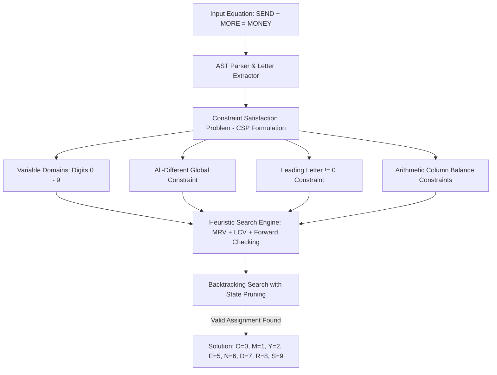

# 🧩 Cryptarithmetic Puzzle Solver & AI Constraint Laboratory
> **High-performance TypeScript & Electron solver for Cryptarithmetic Constraint Satisfaction Problems (CSP) featuring Backtracking, Minimum Remaining Values (MRV), Forward Checking, and AC-3 Arc Consistency.**

[](https://opensource.org/licenses/MIT)
[](https://www.typescriptlang.org/)
[]()
[]()

---

## 🏛️ Monorepo Architecture

```
cryptarithmetic-solver/
├── packages/
│   ├── solver-core/       # Core CSP algorithms: MRV, LCV, Forward Checking, Backtracking
│   ├── electron-app/      # Cross-platform desktop interface with visual step-by-step solver
│   └── shared/            # Common domain types, AST expression parser, and validator
└── package.json           # Workspace root
```



---

## 🚀 Core Algorithmic Techniques

* **Minimum Remaining Values (MRV):** Prioritizes assigning values to the variable with the fewest remaining legal choices, triggering failure branches as early as possible.
* **Least Constraining Value (LCV):** Prefers values that rule out the fewest choices for neighboring variables in the constraint graph.
* **Forward Checking & Arc Consistency (AC-3):** Propagates constraints across arithmetic columns after every assignment, pruning invalid search space branches.

---

## 📦 Quick Start

### Installation
```bash
git clone https://github.com/harinish45/cryptarithmetic-solver.git
cd cryptarithmetic-solver
npm install
```

### Running Solver Core Tests
```bash
npm run test --workspace=packages/solver-core
```

### Launching Desktop UI
```bash
npm run start --workspace=packages/electron-app
```

---

## 🤖 Vibe Coding & Autonomous AI Tool Instructions
* [`PRD.md`](./PRD.md) — Formal CSP definition and mathematical specifications.
* [`TODO.md`](./TODO.md) — Atomic implementation checklist with unit test acceptance criteria.
* [`AGENTS.md`](./AGENTS.md) — Algorithmic invariants and coding rules.

---

## 📄 License
This project is licensed under the **MIT License** - see the [LICENSE](LICENSE) file for details.
